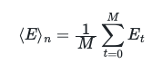
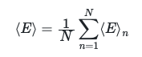
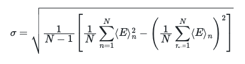

# The variance for the block averages

In this exercise we are going to compute the variance for the block averages.

The previous exercise showed you how to compute the variance over the whole trajectory.  We also learned that this variance is not going to be useful in terms of us calculating the error bars for our ensemble averages.  The error bars on the ensemble average will be computed by calculating the average of the block averages.  In other words, we are going to calculate N block averages over each of the M-frame blocks in our trajectory using:

We will assume that these N block averages represent N samples of the same random variable.  We can thus calculate the average for this random variable as:

Furthermore, because we have N samples, we can calculate the standard deviation (the error) for this average using:

I would like you to insert code in `main.py` that computes the average energy from the blocks using the second equation on this page and the error in this quantity using the third equation on this page.  To do this you are going to first have to compute block averages over the first 100, second 100, third 100 and so on frames in the trajectory as you have done in previous exercises.  You are then going to have to compute the quantities above from these block averages.  The final value that you get for the average energy should be saved in a variable called `average` and the final value for the error should be saved in a variable called `error`.
